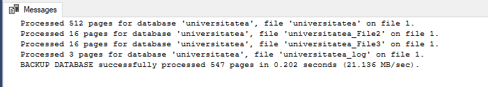
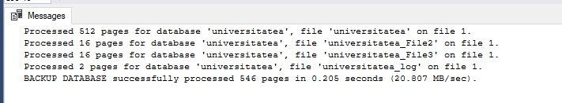
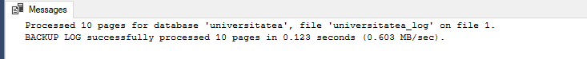
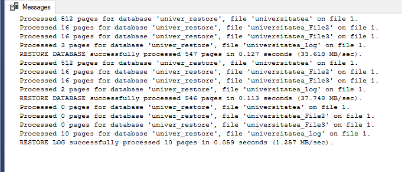

### Task 1
```SQL
EXEC sp_addumpdevice 'DISK', 'device1', 'D:\UNIVERSITATE\DB-work\lab11\files\device1_task1.bak'
GO
BACKUP DATABASE universitatea
TO device1 
WITH FORMAT,
NAME = N'universitatea- Full Database Backup'
GO
```



### Task 2
```SQL
EXEC sp_addumpdevice 'DISK', 'device2', 'D:\UNIVERSITATE\DB-work\lab11\files\device2_task2.bak'
GO
BACKUP DATABASE universitatea
TO device2 
WITH FORMAT,
NAME = N'universitatea- Differential Database Backup'
GO
```




### Task 3
```SQL
EXEC sp_addumpdevice 'DISK','backup_Log', 'D:\UNIVERSITATE\DB-work\lab11\files\task3.bak'
GO
BACKUP LOG universitatea
TO backup_Log
GO
```



### Task 4
```SQL
RESTORE DATABASE univer_restore
FROM DISK = 'D:\UNIVERSITATE\DB-work\lab11\files\device1_task1.bak'
WITH MOVE 'universitatea' TO 'C:\Program Files\Microsoft SQL Server\MSSQL14.MSSQLSERVER\MSSQL\DATA\univer_restore',
MOVE 'universitatea_File2' TO 'C:\Program Files\Microsoft SQL Server\MSSQL14.MSSQLSERVER\MSSQL\DATA\univer_restore_File2',
MOVE 'universitatea_File3' TO 'C:\Program Files\Microsoft SQL Server\MSSQL14.MSSQLSERVER\MSSQL\DATA\univer_restore_File3',
MOVE 'universitatea_log' TO 'C:\Program Files\Microsoft SQL Server\MSSQL14.MSSQLSERVER\MSSQL\DATA\univer_restore_log.ldf',
NORECOVERY
GO

RESTORE DATABASE univer_restore
FROM DISK = 'D:\UNIVERSITATE\DB-work\lab11\files\device2_task2.bak'
WITH NORECOVERY
GO

RESTORE LOG univer_restore
FROM DISK = 'D:\UNIVERSITATE\DB-work\lab11\files\task3.bak'
WITH NORECOVERY
```


