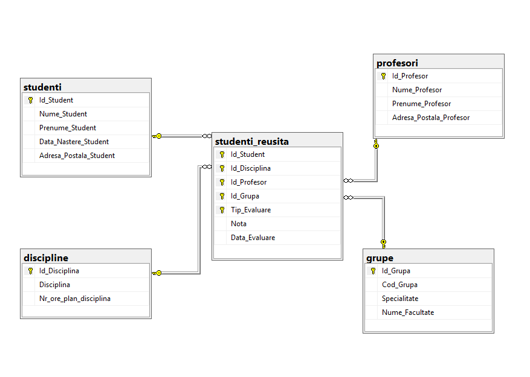
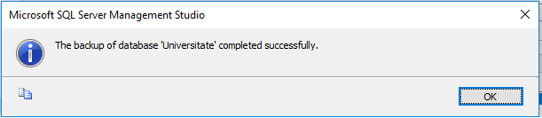

<h4>Task 1</h4>
a) 16,2
b) 116,2
<h4>Task 2</h4>
int max value is 2,147,483,647; Decimal(2, 1) max value is 9,9; the result will fit in Decimal(12,1).
<h5><b>OR</b></h5>
if we get only the data from the table, the result will fit in Decimal(2, 1)
<h4>Task 3</h4>

