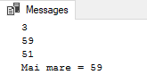
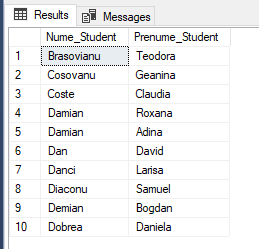
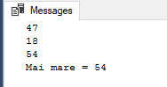
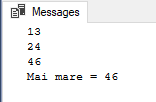
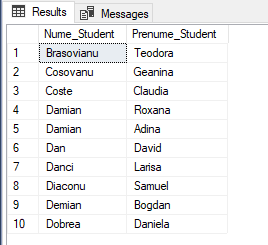

### TASK 1
```SQL
DECLARE @N1 INT, @N2 INT, @N3 INT;
DECLARE @MAI_MARE INT;
SET @N1 = 60 * RAND();
SET @N2 = 60 * RAND();
SET @N3 = 60 * RAND();

SET @MAI_MARE = @N1;
IF @MAI_MARE < @N2
	SET @MAI_MARE = @N2;
IF @MAI_MARE < @N3
	SET @MAI_MARE = @N3;

PRINT @N1;
PRINT @N2;
PRINT @N3;
PRINT 'Mai mare = ' + CAST(@MAI_MARE AS VARCHAR(2));

```


### TASK 2
```SQL
DECLARE @TIP_EVALUARE VARCHAR(20);
DECLARE @DISCIPLINA VARCHAR(20);

SET @TIP_EVALUARE = 'Testul 1';
SET @DISCIPLINA = 'Baze de date';


SELECT TOP 10 Nume_Student, Prenume_Student FROM studenti
WHERE Id_Student IN (	
	SELECT IIF(Nota <> 6 AND Nota <> 8, Id_Student, null) FROM studenti_reusita sr
	INNER JOIN discipline d on d.Id_Disciplina = sr.Id_Disciplina
	WHERE Tip_Evaluare = @TIP_EVALUARE and Disciplina = @DISCIPLINA
)

```


### TASK 3
```SQL
DECLARE @N1 INT, @N2 INT, @N3 INT;
DECLARE @MAI_MARE INT;
SET @N1 = 60 * RAND();
SET @N2 = 60 * RAND();
SET @N3 = 60 * RAND();

SET @MAI_MARE = CASE 
	WHEN @N1 > @N2 AND @N1 > @N3 THEN @N1
	WHEN @N2 > @N1 and @N2 > @N3 THEN @N2
	ELSE @N3
END

PRINT @N1;
PRINT @N2;
PRINT @N3;
PRINT 'Mai mare = ' + CAST(@MAI_MARE AS VARCHAR(2));

```


### TASK 4_1
```SQL
DECLARE @N1 INT, @N2 INT, @N3 INT;
DECLARE @MAI_MARE INT;
SET @N1 = 60 * RAND();
SET @N2 = 60 * RAND();
SET @N3 = 60 * RAND();

BEGIN TRY
	SET @MAI_MARE = CASE 
		WHEN @N1 > @N2 AND @N1 > @N3 THEN @N1
		WHEN @N2 > @N1 and @N2 > @N3 THEN @N2
		ELSE @N3
	END
	PRINT @N1;
	PRINT @N2;
	PRINT @N3;
	PRINT 'Mai mare = ' + CAST(@MAI_MARE AS VARCHAR(2));
END TRY
BEGIN CATCH
	DECLARE @EROARE VARCHAR(20);
	SET @EROARE = 'Eroare la procesare';
	PRINT @EROARE;
	RAISERROR (@EROARE, 8, 1);  
END CATCH
```


### TASK 4_2
```SQL
DECLARE @TIP_EVALUARE VARCHAR(20);
DECLARE @DISCIPLINA VARCHAR(20);

SET @TIP_EVALUARE = 'Testul 1';
SET @DISCIPLINA = 'Baze de date';


BEGIN TRY
	SELECT TOP 10 Nume_Student, Prenume_Student FROM studenti
	WHERE Id_Student IN (	
		SELECT IIF(Nota <> 6 AND Nota <> 8, Id_Student, null) FROM studenti_reusita sr
		INNER JOIN discipline d on d.Id_Disciplina = sr.Id_Disciplina
		WHERE Tip_Evaluare = @TIP_EVALUARE and Disciplina = @DISCIPLINA
)
END TRY
BEGIN CATCH
	DECLARE @EROARE VARCHAR(20);
	SET @EROARE = 'Eroare la procesare';
	PRINT @EROARE;
	RAISERROR (@EROARE, 8, 1);  
END CATCH
```

