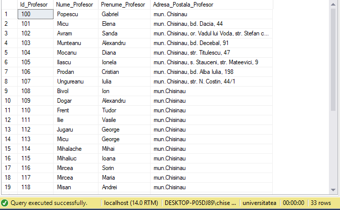
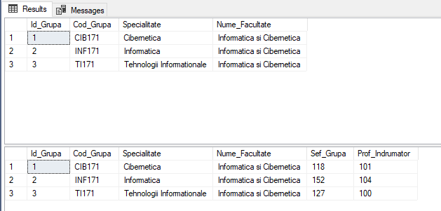
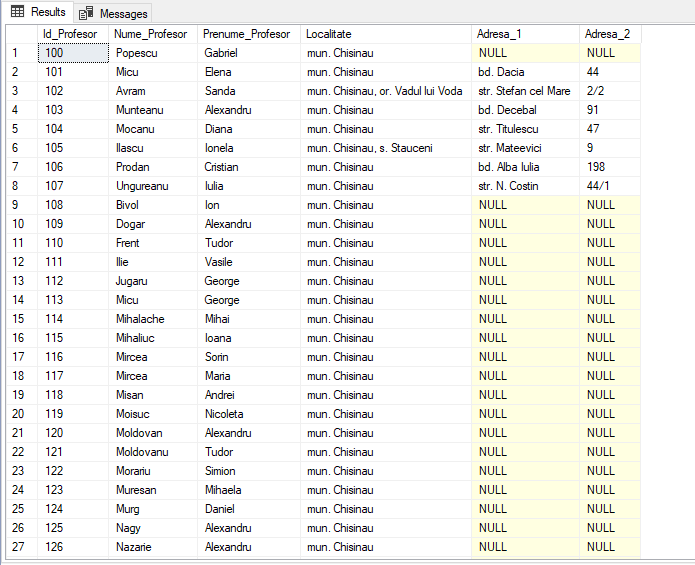
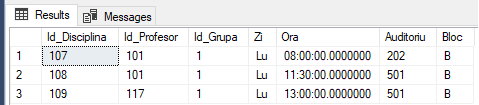
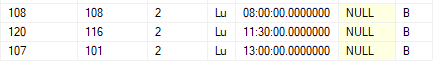
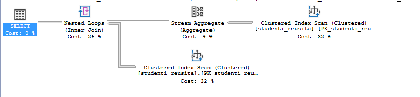
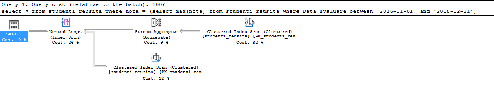
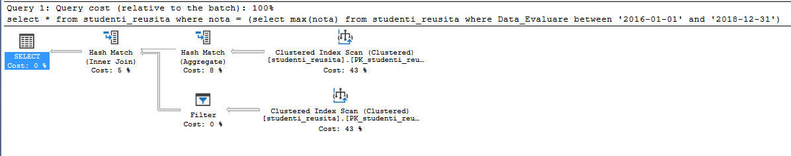

### TASK 1
```SQL
update profesori
    set Adresa_Postala_Profesor='mun. Chisinau' 
    where Adresa_Postala_Profesor is null
select * from profesori
```


### TASK 2
```SQL
alter table grupe 
  add unique (Cod_Grupa)
alter table grupe 
  alter column Cod_Grupa char(6) NOT NULL;
```

### TASK 3
```SQL
select * from grupe

alter table grupe
	add Sef_Grupa int

alter table grupe
	add Prof_Indrumator int
go
update grupe set sef_grupa = (
	select id_student
	from studenti_reusita sr
	where sr.Id_Grupa = grupe.Id_Grupa
	group by id_student
	having avg(cast(nota as float)) >= all(
		select avg(cast(nota as float))
			from studenti_reusita sr
			where sr.Id_Grupa = grupe.Id_Grupa
			group by Id_Student
	)
)

update grupe set Prof_Indrumator = (
	select id_profesor from(
		select top 1 id_profesor, count(distinct Id_Disciplina) Nr_Discipline from studenti_reusita
			where id_grupa = grupe.Id_Grupa
			group by Id_Profesor
			order by Nr_Discipline desc, id_profesor asc
	) as r
)

select * from grupe
```


### TASK 4
```SQL
update studenti_reusita set Nota = (
	case
		when Nota >= 9 Then 10
		else Nota + 1
	end
)
where Id_Student in (select sef_grupa from grupe)
```

### TASK 5
```SQL
create table profesori_new (
	Id_Profesor int NOT NULL,
	Nume_Profesor char(255),
	Prenume_Profesor char(255),
	Localitate char (60) DEFAULT ('mun. Chisinau'),
	Adresa_1 char (60),
	Adresa_2 char (60),
	CONSTRAINT [PK_profesori_new] PRIMARY KEY CLUSTERED (Id_Profesor)
) ON [PRIMARY]

insert into profesori_new (Id_Profesor, Nume_Profesor, Prenume_Profesor, Localitate, Adresa_1, Adresa_2) 
(
	select Id_Profesor, Nume_Profesor, Prenume_Profesor, Adresa_Postala_Profesor, Adresa_Postala_Profesor, Adresa_Postala_Profesor from profesori
)

update profesori_new
	set Localitate =
	case
		when CHARINDEX ('str.', Localitate) > 0
			then SUBSTRING (Localitate, 1, CHARINDEX ('str.', Localitate) - 3)
		when CHARINDEX ('bd.', Localitate) > 0
			then SUBSTRING (Localitate, 1, CHARINDEX ('bd.',Localitate) - 3)
		else Localitate
	end,
	Adresa_1 =
	case
		when CHARINDEX ('str.', Adresa_1) > 0
			then SUBSTRING (Adresa_1, CHARINDEX ('str.', Adresa_1), LEN(Adresa_1))
		when CHARINDEX ('bd.', Adresa_1) > 0
			then SUBSTRING (Adresa_1, CHARINDEX ('bd.', Adresa_1), LEN(Adresa_1))
		else null
	end

update profesori_new set Adresa_2 =
	case
		when CHARINDEX (',', Adresa_1) > 0
			then SUBSTRING (Adresa_1, CHARINDEX (',', Adresa_1) + 2, LEN(Adresa_1))
		else null
	end,
	Adresa_1 =
	case
		when CHARINDEX (',', Adresa_1) > 0
			then SUBSTRING (Adresa_1, 1, CHARINDEX (',', Adresa_1) - 1)
		else Adresa_1
	end

select * from profesori_new

```


### TASK 6
```SQL
create table orarul (
	Id_Disciplina int,
	Id_Profesor int,
	Id_Grupa smallint foreign key references grupe(Id_Grupa),
	Zi char(2),
	Ora time,
	Auditoriu int,
	Bloc char(1) default('B')
)

Insert orarul (Id_Disciplina , Id_Profesor, Id_Grupa, Zi, Ora, Auditoriu) values 
	(107, 101, 1, 'Lu', '08:00', 202 ),
	(108, 101, 1, 'Lu', '11:30', 501 ),
	(109, 117, 1, 'Lu', '13:00', 501 )

select * from orarul
```



### TASK 7
```SQL
declare @id_grupa int
set @id_grupa = (select Id_Grupa from grupe where Cod_Grupa = 'INF171')

insert into orarul (Id_Disciplina, Id_Profesor, Id_Grupa, Zi, Ora) values
	(
		(select Id_Disciplina from discipline where Disciplina = 'Structuri de date si algoritmi'),
		(select Id_Profesor from profesori where Nume_Profesor = 'Bivol' and Prenume_Profesor = 'Ion'),
		@id_grupa, 'Lu', '08:00'
	),
	(
		(select Id_Disciplina from discipline where Disciplina = 'Programe aplicative'),
		(select Id_Profesor from profesori where Nume_Profesor = 'Mircea' and Prenume_Profesor = 'Sorin'),
		@id_grupa, 'Lu', '11:30'
	),
	(
		(select Id_Disciplina from discipline where Disciplina = 'Baze de date'),
		(select Id_Profesor from profesori where Nume_Profesor = 'Micu' and Prenume_Profesor = 'Elena'),
		@id_grupa, 'Lu', '13:00'
	)
select * from orarul
```


### TASK 8
```SQL
create nonclustered index [some_index_name_1]
     ON studenti_reusita (data_evaluare)
	 on userdatafgroup01


create nonclustered columnstore index [some_index_name_2]
     ON studenti_reusita (data_evaluare)
	 on userdatafgroup01


select * from studenti_reusita where nota = (select max(nota) from studenti_reusita where Data_Evaluare between '2016-01-01' and '2018-12-31')
```
#### Without nonclustered index

#### With nonclustered index

#### With nonclustered columnstore index


