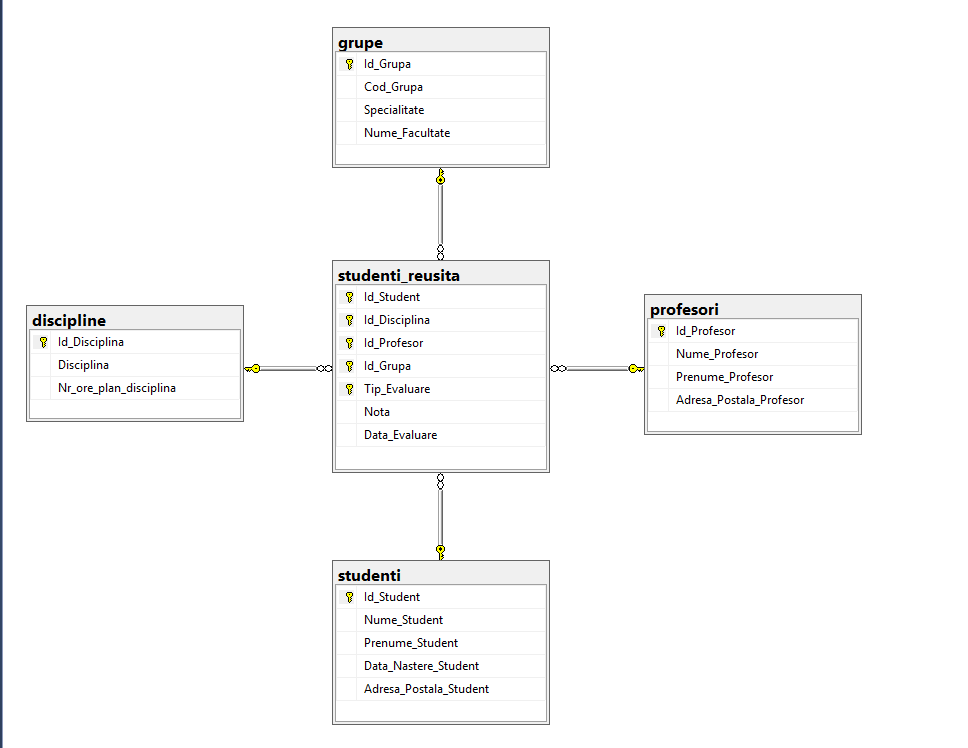
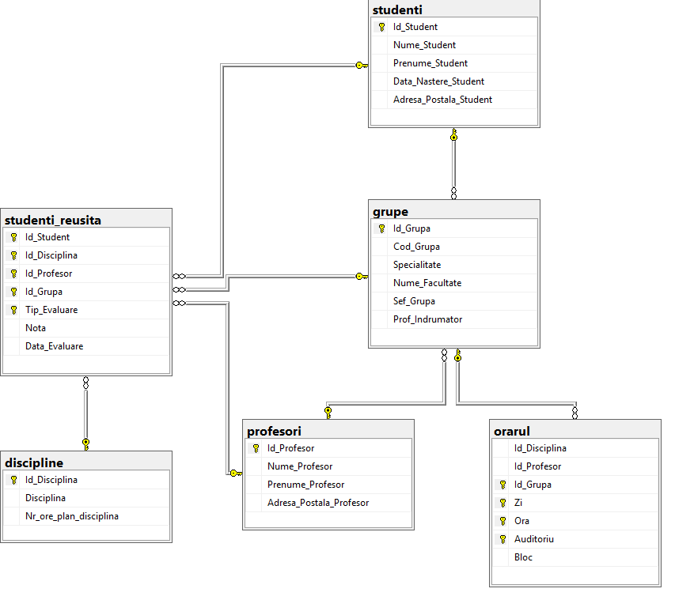
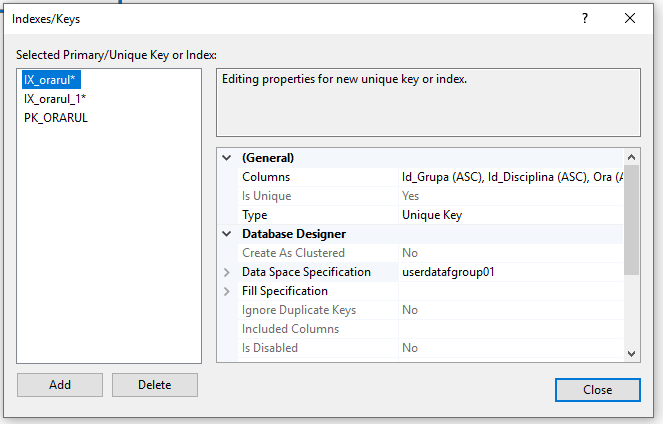
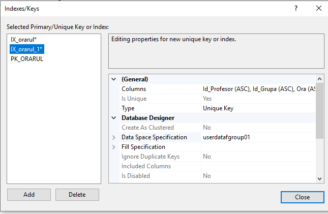
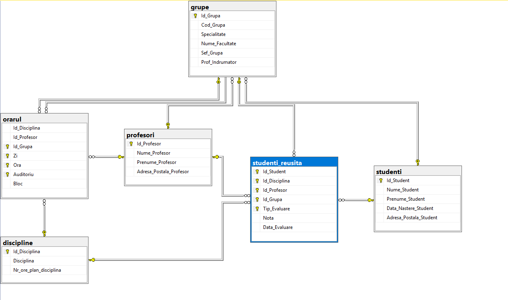
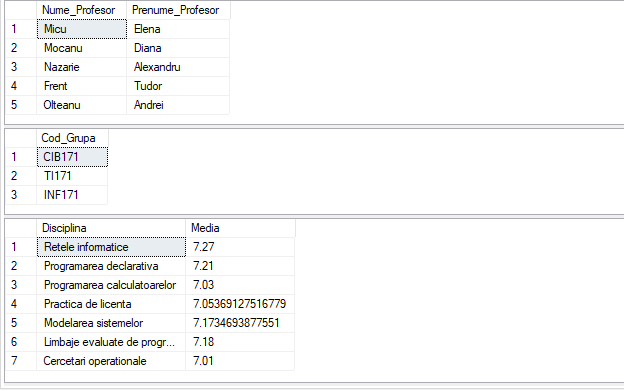

### Task 1



### Task 2
```SQL
alter table grupe
	add constraint FK_SEF_GRUPA foreign key (sef_grupa) references studenti(id_student)
alter table grupe
	add constraint FK_PROF_INDRUMATOR foreign key (prof_indrumator) references profesori(id_profesor)
```


### Task 3
```SQL
create table orarul (
	Id_Disciplina int,
	Id_Profesor int,
	Id_Grupa smallint foreign key references grupe(Id_Grupa),
	Zi char(2),
	Ora time,
	Auditoriu int,
	Bloc char(1) default('B'),
	constraint PK_ORARUL primary key (id_grupa, zi, ora, auditoriu) 
)
```



### Task 4




### Task 5
```SQL
alter table orarul
	add constraint FK_DISCIPLINE foreign key (id_disciplina) references discipline(id_disciplina)
alter table orarul
	add constraint FK_GRUPE foreign key (id_grupa) references grupe(id_grupa)
alter table orarul
	add constraint FK_PROFESORI foreign key (id_profesor) references profesori(id_profesor)
```



### Task 6
```SQL
create schema cadre_didactice
go
alter schema cadre_didactice transfer dbo.profesori

go
create schema plan_studii
go
alter schema plan_studii transfer dbo.orarul
alter schema plan_studii transfer dbo.discipline

go
create schema studenti
go
alter schema studenti transfer dbo.studenti
alter schema studenti transfer dbo.studenti_reusita
```


### Task 7
```SQL
--19
SELECT DISTINCT Nume_Profesor, Prenume_Profesor FROM studenti.studenti_reusita sr
	INNER JOIN cadre_didactice.profesori p on p.Id_Profesor = sr.Id_Profesor
	INNER JOIN studenti.studenti s on s.Id_Student = sr.Id_Student
WHERE nota < 5 AND Nume_Student = 'Cosovanu'

--25
SELECT Cod_Grupa FROM studenti.studenti_reusita sr
	INNER JOIN grupe g on g.Id_Grupa = sr.Id_Grupa
GROUP BY Cod_Grupa
HAVING count(DISTINCT Id_Student) > 24


--35
SELECT DISTINCT Disciplina, AVG(cast(Nota as float)) Media FROM studenti.studenti_reusita sr
	INNER JOIN plan_studii.discipline d on d.Id_Disciplina = sr.Id_Disciplina
GROUP BY Disciplina
HAVING AVG(cast(Nota as float)) > 7
ORDER BY Disciplina DESC

```



### Task 8
```SQL
CREATE SYNONYM ss FOR studenti.studenti
CREATE SYNONYM ssr FOR studenti.studenti_reusita
CREATE SYNONYM psd FOR plan_studii.discipline
CREATE SYNONYM cdp FOR cadre_didactice.profesori

--19
SELECT DISTINCT Nume_Profesor, Prenume_Profesor FROM ssr sr
	INNER JOIN cdp p on p.Id_Profesor = sr.Id_Profesor
	INNER JOIN ss s on s.Id_Student = sr.Id_Student
WHERE nota < 5 AND Nume_Student = 'Cosovanu'

--25
SELECT Cod_Grupa FROM ssr sr
	INNER JOIN grupe g on g.Id_Grupa = sr.Id_Grupa
GROUP BY Cod_Grupa
HAVING count(DISTINCT Id_Student) > 24


--35
SELECT DISTINCT Disciplina, AVG(cast(Nota as float)) Media FROM ssr sr
	INNER JOIN psd d on d.Id_Disciplina = sr.Id_Disciplina
GROUP BY Disciplina
HAVING AVG(cast(Nota as float)) > 7
ORDER BY Disciplina DESC

```
