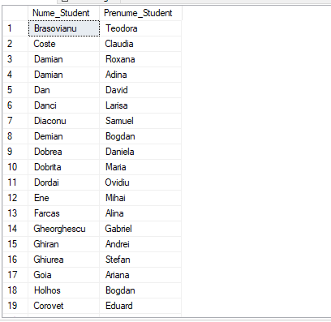
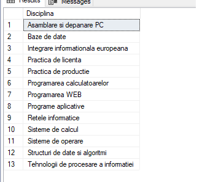
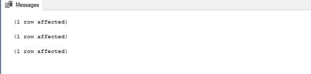
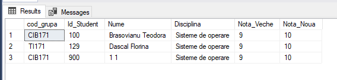
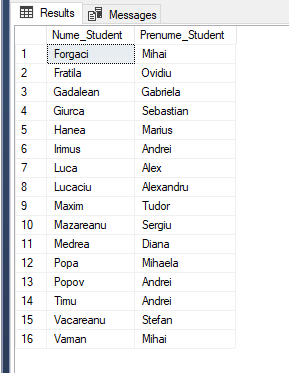
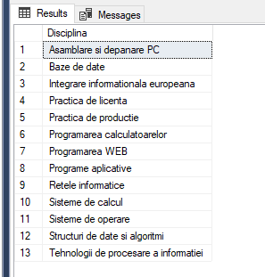
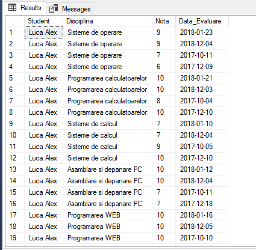
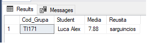

### Task 1
```SQL
DROP PROCEDURE IF EXISTS task1_1;
GO

CREATE PROCEDURE task1_1
		@evaluare VARCHAR(20) = 'examen',
		@data SMALLINT = 2018,
		@disciplina VARCHAR(20) = 'Baze de date',
		@nota1 SMALLINT = 4,
		@nota2 SMALLINT = 8
AS

SELECT Nume_Student, Prenume_Student
FROM ss JOIN ssr ON ss.Id_Student = ssr.Id_Student
			   JOIN psd ON ssr.Id_Disciplina = psd.Id_Disciplina
WHERE Tip_Evaluare = @evaluare
AND   YEAR(Data_Evaluare) = @data
AND   Disciplina = @disciplina
AND   Nota BETWEEN @nota1 and @nota2;
GO
exec task1_1
```



```SQL
DROP PROCEDURE IF EXISTS task1_2
GO

CREATE PROCEDURE task1_2
   @nume VARCHAR(10) = 'Florea', 
   @prenume VARCHAR(10) = 'Ioan' 
AS

SELECT DISTINCT Disciplina
FROM psd JOIN ssr ON psd.Id_Disciplina = ssr.Id_Disciplina
				 JOIN ss ON ssr.Id_Student = ss.Id_Student
WHERE Nume_Student = @nume	
AND   Prenume_Student = @prenume
GO
EXEC task1_2
```



### Task 2
```SQL
DROP PROCEDURE IF EXISTS task2;
GO

CREATE PROCEDURE task2
   @count SMALLINT = NULL OUTPUT
AS
	SELECT @count = COUNT(DISTINCT Id_student) 
	FROM ssr
	WHERE Nota < 5 or Nota = NULL
GO

DECLARE @count SMALLINT
EXEC task2 @count OUTPUT
PRINT 'Nu au sustinut ' + cast(@count as VARCHAR(3)) + ' student(i).'
```


### Task 3
```SQL
DROP PROCEDURE IF EXISTS task3
GO

CREATE PROCEDURE task3 
@name1 VARCHAR(50),
@name2 VARCHAR(50),
@date DATE,
@address VARCHAR(500),
@group CHAR(6)
AS
INSERT INTO ss 
	VALUES (998, @name1, @name2, @date, @address)
INSERT INTO ssr
	VALUES (998, 100, 100, (SELECT Id_Grupa FROM grupe WHERE Cod_Grupa = @group), 'examen', NULL, GETDATE())

GO

exec task3 'Chiseliov', 'Eugen-Catalin', '1997-02-02',' mun.Chisinau', 'TI171'
```



### Task 4
```SQL
DROP PROCEDURE IF EXISTS task4
GO
CREATE PROCEDURE task4
	@name1_old VARCHAR(60),
	@name2_old VARCHAR(60),
	@name1_new VARCHAR(60),
	@name2_new VARCHAR(60),
	@subject VARCHAR(20)
AS
BEGIN
	DECLARE @ID_DISCIPLINA INT
	DECLARE @ID_PROFESOR_OLD INT
	DECLARE @ID_PROFESOR_NEW INT
	SELECT @ID_DISCIPLINA = Id_Disciplina FROM psd WHERE Disciplina = @subject

	IF(@ID_DISCIPLINA IS NULL)
		PRINT 'Disciplina inexistenta'
	ELSE
	BEGIN
		SET @ID_PROFESOR_OLD = (SELECT Id_Profesor FROM cdp WHERE Nume_Profesor = @name1_old AND Prenume_Profesor = @name2_old)
		IF(@ID_PROFESOR_OLD IS NULL)
			PRINT 'Profesor vechi inexistent'
		ELSE 
		BEGIN
			IF ((SELECT COUNT(*) FROM ssr where Id_Disciplina = @ID_DISCIPLINA AND Id_Profesor = @ID_PROFESOR_OLD) > 0)
			BEGIN
				SET @ID_PROFESOR_NEW = (SELECT Id_Profesor FROM cdp WHERE Nume_Profesor = @name1_new AND Prenume_Profesor = @name2_new)
				IF(@ID_PROFESOR_NEW IS NULL)
					PRINT 'Profesor nou inexistent'
				ELSE
				BEGIN
					UPDATE ssr
					SET Id_Profesor = @ID_PROFESOR_NEW
					WHERE Id_Profesor = @ID_PROFESOR_OLD AND Id_Disciplina = @ID_DISCIPLINA
				END
			END
			ELSE
				PRINT 'Nu sunt date de actualizat'
		END
	END
END
GO

EXEC task4 'Moldovan', 'Alexandru', 'Popescu', 'Gabriel',  'Sisteme de operare'
```


### Task 5
```SQL
DROP PROCEDURE IF EXISTS p1
GO

CREATE PROCEDURE p1 
@disciplina VARCHAR(20)
AS
declare @stud_list table (Id_Student int, Meida float)
declare @id_disciplina int

set @id_disciplina = (select id_disciplina from psd where Disciplina = @disciplina)

insert into @stud_list
	select TOP (3) ssr.Id_Student, AVG(cast (Nota as float)) as Media
		from ssr
		where ssr.Id_Disciplina = @id_disciplina
		Group by ssr.Id_Student
		order by Media desc

select cod_grupa, ss.Id_Student, concat(nume_student, ' ', Prenume_Student) Nume, @disciplina Disciplina, nota Nota_Veche, iif(nota > 9, 10, nota + 1) Nota_Noua from ssr
	inner join grupe g on g.Id_Grupa = ssr.Id_Grupa
	inner join ss on ss.Id_Student = ssr.Id_Student
	where ss.Id_Student in (select Id_Student from @stud_list)
		and ssr.Id_Disciplina = @id_disciplina
		and Tip_Evaluare = 'Examen'
update ssr
	set nota = (case when nota >= 9 then 10 else nota + 1 end)
	where Tip_Evaluare = 'Examen'
		and Id_Disciplina = @id_disciplina
		and Id_Student in (select Id_Student from @stud_list)
go


execute p1 @disciplina = 'Sisteme de operare'

```



### Task 6
```SQL
DROP FUNCTION IF EXISTS task6_1 
GO
CREATE FUNCTION task6_1 (@evaluare VARCHAR(10), @an SMALLINT, @disciplina VARCHAR(20),
							@nota1 SMALLINT, @nota2 SMALLINT)
RETURNS TABLE
AS
RETURN
	SELECT distinct Nume_Student, Prenume_Student 
	FROM ss, ssr, psd
	WHERE ss.Id_Student = ssr.Id_Student
		and psd.Id_Disciplina = ssr.Id_Disciplina
		and Tip_Evaluare = @evaluare
		and year(Data_Evaluare) = @an 
		and Disciplina = @disciplina
		and Nota between  @nota1 and @nota2

GO

select * from task6_1('Examen', 2018, 'Baze de date', 9, 10)
```



```SQL
DROP FUNCTION IF EXISTS task6_2
GO
CREATE FUNCTION task6_2 (@nume VARCHAR(20), @prenume VARCHAR(20))
RETURNS TABLE
AS
RETURN
	SELECT DISTINCT Disciplina FROM psd
	JOIN ssr ON psd.Id_Disciplina = ssr.Id_Disciplina
	JOIN ss ON ssr.Id_Student = ss.Id_Student
	WHERE Nume_Student = @nume AND Prenume_Student = @prenume
GO

select * from task6_2('Luca', 'Alex')
```



### Task 7
```SQL
DROP FUNCTION IF EXISTS task7
GO

CREATE FUNCTION task7 (@data_nasterii DATE )
RETURNS INT
	BEGIN
	DECLARE @varsta INT
	SELECT @varsta = (
		SELECT (YEAR(GETDATE()) - YEAR(@data_nasterii) - 
			CASE
				WHEN (MONTH(@data_nasterii) > MONTH(GETDATE()))
					OR (MONTH(@data_nasterii) = MONTH(GETDATE()) AND DAY(@data_nasterii)> DAY(GETDATE()))
				THEN  1
				ELSE  0
			END
		)
	)
 RETURN @varsta
 END
 GO

print dbo.task7('2000-11-24')

```


### Task 8
```SQL
DROP FUNCTION IF EXISTS task8
GO

CREATE FUNCTION task8 (@nume_prenume_s VARCHAR(50))
RETURNS TABLE 
AS
RETURN
	SELECT Nume_Student + ' ' + Prenume_Student as Student, Disciplina, Nota, Data_Evaluare
	FROM ss, psd, ssr
	WHERE ss.Id_Student = ssr.Id_Student
		AND psd.Id_Disciplina = ssr.Id_Disciplina 
		AND Nume_Student + ' ' + Prenume_Student = @nume_prenume_s
GO

SELECT * FROM task8('Luca Alex')

```



### Task 9
```SQL
DROP FUNCTION IF EXISTS task9
GO

CREATE FUNCTION task9 (@cod_grupa VARCHAR(10), @is_good VARCHAR(20))
RETURNS @Test Table (Cod_Grupa varchar(10), Student varchar (100), Media decimal(4,2), Reusita varchar(20))
AS
BEGIN
DECLARE @TEMP Table (Cod_Grupa varchar(10), Student varchar (100), Media decimal(4,2), Reusita varchar(20))
INSERT INTO @TEMP
	SELECT Cod_Grupa, Nume_Student + ' ' + Prenume_Student as Student,
		 CAST(AVG( Nota * 1.0) as decimal (4,2)) as Media, @is_good
	FROM grupe, ss, ssr
	WHERE grupe.Id_Grupa = ssr.Id_Grupa
		AND ss.Id_Student = ssr.Id_Student
		AND Cod_Grupa = @cod_grupa
	GROUP BY Cod_Grupa, Nume_Student, Prenume_Student

IF @is_good = 'sarguincios'
	INSERT INTO @Test
		SELECT TOP 1 * FROM @TEMP
			ORDER BY Media DESC
ELSE IF @is_good = 'slab'
	INSERT INTO @Test
		SELECT TOP 1 * FROM @TEMP
			ORDER BY Media
RETURN 
END
GO

SELECT * from task9('TI171', 'sarguincios')

```


